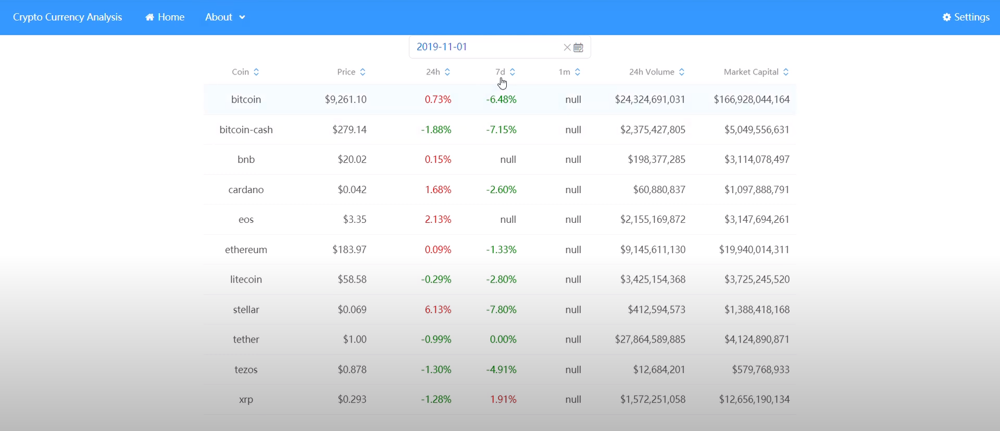

# crypto-currency-analysis

## demo
- 
- [video](https://youtu.be/ycg9G2Yi_Jc)

## requirements
- ``` Ability to setup the data in Relational Database or Nosql Database ```
  - data is inserted from csv to mysql by [python](./clean_and_insert.py)
- ``` Ability to retrieve data from a database or by calling an API. ```
  - data is retrived from database to backend (flask) by ```flaskext.mysql```
  - i.e., substitute parameter in query template
- ``` Ability to process the data or build efficient computational logic using a library/framework best suited for the task OR just using the inherent language features. ```
  - react.js+flask+mysql
  - data communication is through ReSTful API
    - ```
      curl -X GET http://127.0.0.1:5000/test?today=2019-11-01
            [{"1m":null,"24h":0.00729933,"24h_volume":24324691031.0000,"7d":-0.06483031,"Coin":"bitcoin","Market_Cap":166928044164.0000,"Price":9261.1000},{"1m":null,"24h":-0.01880558,"24h_volume":2375427805.0000,"7d":-0.07154116,"Coin":"bitcoin-cash","Market_Cap":5049556631.0000,"Price":279.1400},{"1m":null,"24h":0.00150075,"24h_volume":198377285.0000,"7d":null,"Coin":"bnb","Market_Cap":3114078497.0000,"Price":20.0200},{"1m":null,"24h":0.01682692,"24h_volume":60880837.0000,"7d":-0.02600473,"Coin":"cardano","Market_Cap":1097888791.0000,"Price":0.0423},{"1m":null,"24h":0.02134146,"24h_volume":2155169872.0000,"7d":null,"Coin":"eos","Market_Cap":3147694261.0000,"Price":3.3500},{"1m":null,"24h":0.00092492,"24h_volume":9145611130.0000,"7d":-0.01331739,"Coin":"ethereum","Market_Cap":19940014311.0000,"Price":183.9700},{"1m":null,"24h":-0.00289362,"24h_volume":3425154368.0000,"7d":-0.02799590,"Coin":"litecoin","Market_Cap":3725245520.0000,"Price":58.5800},{"1m":null,"24h":0.06134969,"24h_volume":412594573.0000,"7d":-0.07803468,"Coin":"stellar","Market_Cap":1388418168.0000,"Price":0.0692},{"1m":null,"24h":-0.00990099,"24h_volume":27864589885.0000,"7d":0E-8,"Coin":"tether","Market_Cap":4124890871.0000,"Price":1.0000},{"1m":null,"24h":-0.01304103,"24h_volume":12684201.0000,"7d":-0.04909443,"Coin":"tezos","Market_Cap":579768933.0000,"Price":0.8779},{"1m":null,"24h":-0.01282051,"24h_volume":1572251058.0000,"7d":0.01913876,"Coin":"xrp","Market_Cap":12656190134.0000,"Price":0.2926}]
      ```
- ``` Ability to display the processed data in the required format using a suitable frontend library/framework. ```
  - react.js+rsuite
- ``` Demonstrate TDD approach was taken during the development. ```

## stretch objectives
- ``` Implement/enhance the API that retrieves filtered data based on the parameters passed while calling the API. such as latest filtered by the latest 7 days, 24 hours and 1 months. Ordering from highest to lowest by market cap, coin price etc. ```
  - as shown in the demo, realized by rsuite-table
- ``` Assume you need to keep updating the original database to have the latest data, come up with a caching strategy to fit into the solution. There is no code needed to implement, but a well documented high level solution design diagram will be highly useful ```
  - |cache strategy|pro|con|example
    |---|---|---|---|
    |Cache-Aside|1. best for read-heavy workloads<br/>2. resilient to cache failures<br/>3. flexible data model to be stored in cache (can be different from database)|1. Require extra effort for cache inconsistency<br/>2. if there’s a cache failure, the data may be permanently lost|1. Memcached<br/>2. Redis
    |Read-Through|1. best for read-heavy workloads when the same data is requested many times|1. Require extra effort for cache inconsistency|DynamoDB
    |Write-Through|when paired with read-through caches,<br/>1. we get all the benefits of read-through<br/>2. we also get data consistency guarantee (freeing us from using cache invalidation techniques)|1. introduce extra write latency because data is written to the cache first and then to the main database|DynamoDB
    |Write-Around|1. can be combined with read-through<br/>2. can be combined with cache-aside<br/>3. provides good performance in situations where data is written once and read less frequently or never||1. real-time logs <br/>2. chatroom messages
    |Write-Back/<br/>write-behind|1. improve the write performance <br/>2. good for write-heavy workloads<br/>3. When combined with read-through, it works good for mixed workloads (where the most recently updated and accessed data is always available in cache)<br/>4. resilient to database failures<br/>5. If batching or coalescing is supported, it can reduce overall writes to the database, which decreases the load and reduces costs|1. if the database provider charges by number of requests and write heavy, no cost reduction|InnoDB

  - Above all,
    - if not heavy workload, read-through + write-around
    - if heavy workload, read-through + write-through
    - if mixed workload, read-through + write-back
  - [reference 1](https://codeahoy.com/2017/08/11/caching-strategies-and-how-to-choose-the-right-one/)
  - [reference 2](https://bluzelle.com/blog/things-you-should-know-about-database-caching)